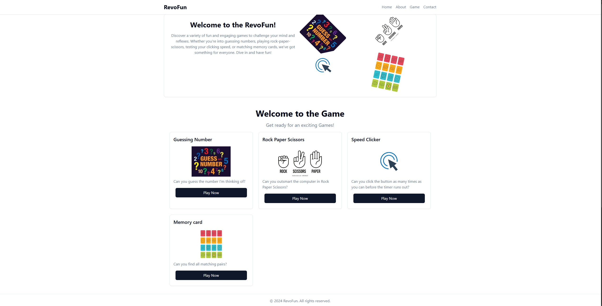
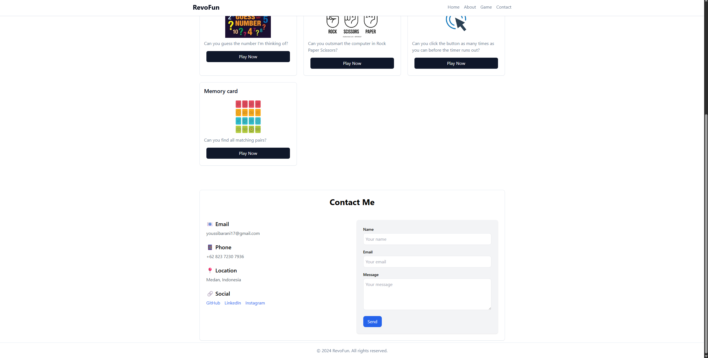
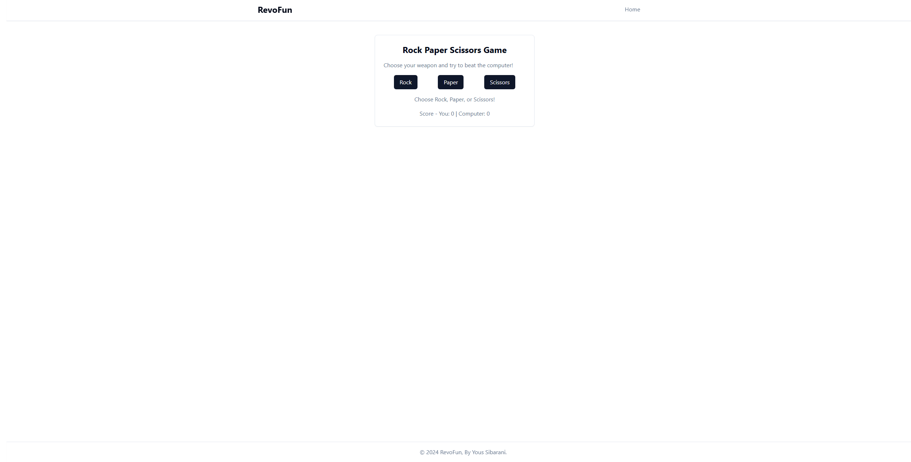
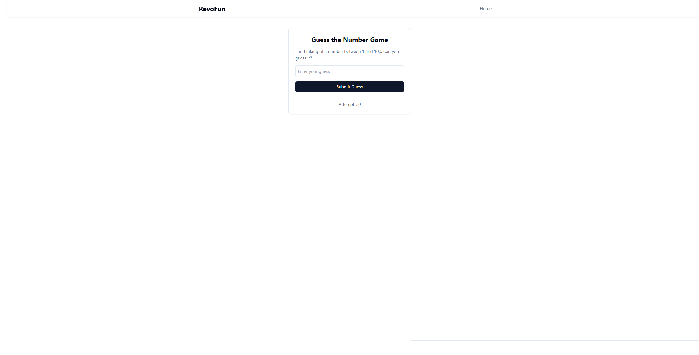
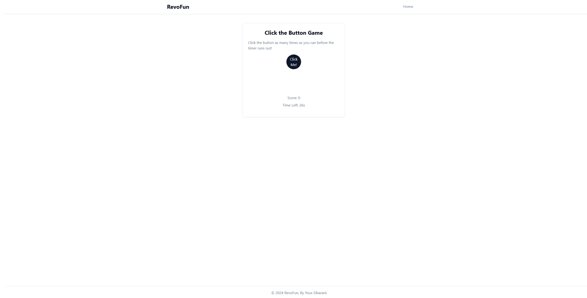
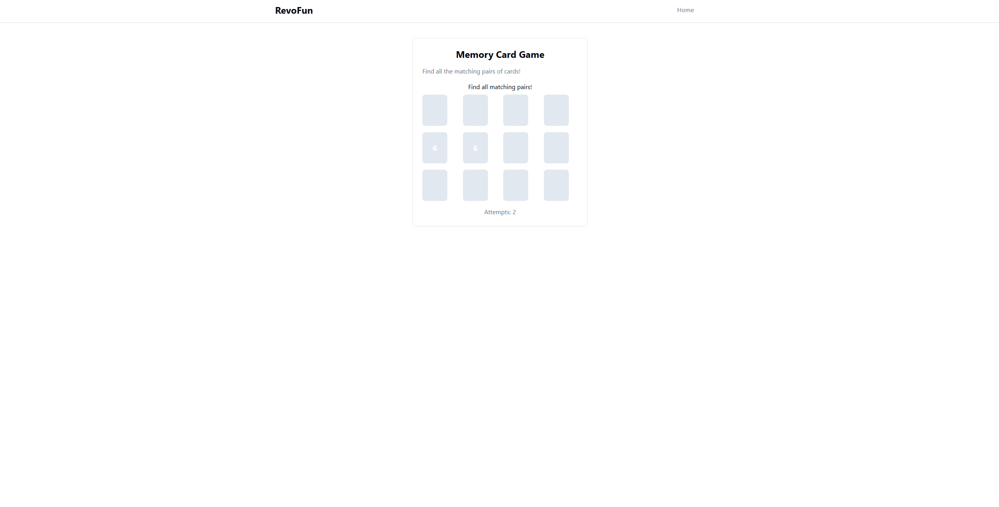

# RevoFun by Yous Sibarani

## Overview

This website provides 4 games that can be played, along with contacts to contact me

## Features

- Semantic HTML structure
- Contact to get in touch
- Navbar as navigation

## Website Section

- **About**

  Welcome words to users who want to play games

- **Game**

  Displays games that are accessible to players

- **Contact**

  Contains information about who can be contacted

## Preview

### Home Page

    The home page contains 3 sections, namely, the about section to welcome and introduce the website to players, the game section to provide games that can be accessed, and the contact section to provide contacts that players can contact.

### Rock Paper Scisccors

    A classic game where players choose between rock, paper, or scissors and compete against the computer's choice. The winner is determined by simple rules: rock beats scissors, scissors beats paper, and paper beats rock.

### Guessing Number

    A number-guessing game where the computer randomly selects a number, and the player must guess it. Feedback is provided on whether the guess is too high or too low until the player finds the correct number.

### Clicking Game

    A simple game to test your clicking speed. Players must click as many times as possible in 30 seconds, and scores are calculated based on the number of successful clicks.

### Memory Card Game

    A number-guessing game where the computer randomly selects a number, and the player must guess it. Feedback is provided on whether the guess is too high or too low until the player finds the correct number.

## Technologies Used

- HTML5
- Tailwind
- Java Script

## kontak

Email: [youssibarani17@gmail.com](mailto:youssibarani17@gmail.com)
